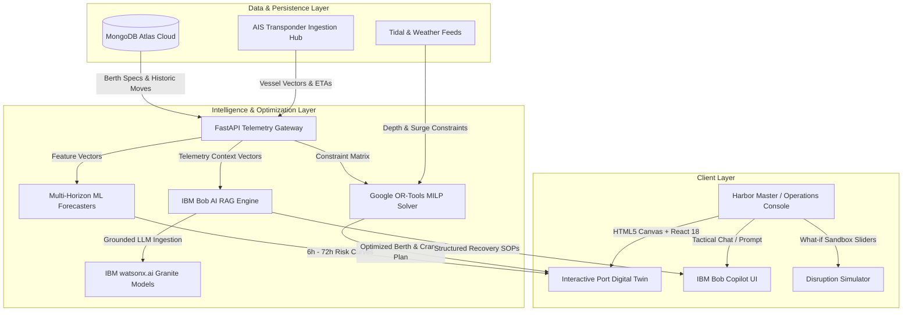
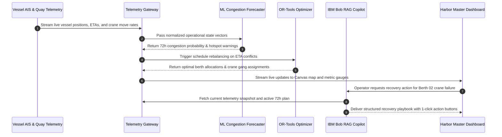

# ⚓ System Architecture — PortFlow AI Platform

## High-Level System Architecture

PortFlow AI is structured as a decoupled, reactive event-driven architecture designed for high-throughput maritime telemetry processing, real-time spatial digital twin rendering, and low-latency operational guidance.

## System Components

| Component | Technology Stack | Core Operational Responsibility |
|---|---|---|
| **Digital Twin GIS Map** | React 18, HTML5 2D Canvas | Real-time 60-FPS rendering of maritime channels, vessel coordinates, AIS vectors, quay cranes, and berth occupancy indicators. |
| **Operational Consoles** | Tailwind CSS, Lucide Icons, Recharts | 7 dedicated views: Command Center, Port Map, Predictions, Optimization, Route Advisor, Simulator, and Copilot. |
| **Multi-Horizon Predictor** | Gradient-Boosted Time Series (XGBoost) | Evaluates quayside congestion, crane utilization, and anchorage queue lengths across 6h, 12h, 24h, 48h, and 72h horizons. |
| **Berth & Crane Optimizer** | Google OR-Tools (MILP) | Solves continuous berth allocation problems (BAP) and quay crane assignment problems (QCAP) under tidal window constraints. |
| **AI Copilot (RAG Engine)** | IBM Bob AI, watsonx.ai Granite | Ingests real-time terminal telemetry into dynamic context embeddings to provide grounded, hallucination-free tactical recovery recommendations. |
| **Data Persistence** | MongoDB Atlas Cloud | Scalable NoSQL storage for vessel registries, berth metadata, operational logs, and historical crane moves. |

## End-to-End Data Flow

## Security Considerations

- **Zero Credential Exposure:** All API keys (`IBM_BOB_API_KEY`, `WATSONX_API_KEY`, `MONGODB_URI`) are injected via environment variables and strictly excluded from git tracking via `.gitignore`.
- **CORS Restricted Endpoints:** Cross-Origin Resource Sharing is locked to authorized terminal operator domains and local development ports.
- **Client-Side Data Sanitization:** All user prompts in the Copilot console are sanitized before payload transmission.

## Scalability & Production Readiness

- **Canvas Rendering Efficiency:** By utilizing procedural Canvas 2D rendering rather than heavy DOM-based SVG map layers, the terminal map effortlessly scales to display hundreds of simultaneous vessels, buoys, and gantries with zero framerate degradation.
- **Stateless Intelligence Microservices:** The ML forecaster and OR-Tools optimization engines are stateless and can scale horizontally across Kubernetes/OpenShift pods behind an ingress load balancer.
- **Asynchronous Telemetry Ingestion:** The architecture is designed for non-blocking I/O, allowing continuous high-frequency AIS transponder telemetry ingestion without stalling client dashboard updates.

